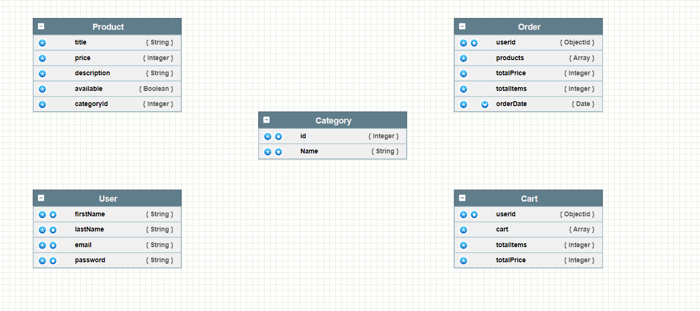

# Triveous-Assignment
Piyush Tale backend assignment: “Ecommerce API with Node js”

# Instruction to setup project Locally
1) Git clone this repo https://github.com/Piyush24102000/Triveous-Assignment.git
2) Go to project folder and install dependencies using "npm install"
3) After Installation of packages type "npm run dev" to run nodemon server.js (http://localhost:5000)

# Features Added
1) Rate Limiter 50 requests / IP in 15 minutes
2) Bcrypt Password Hashing
3) JWT token for authentication
4) Cookies for session (cookie-parser)
5) Project Structure

# Database Design (NoSQl MongoDB)

# API Documentation
Refer this link https://documenter.getpostman.com/view/31515733/2s9YeK3pQL

